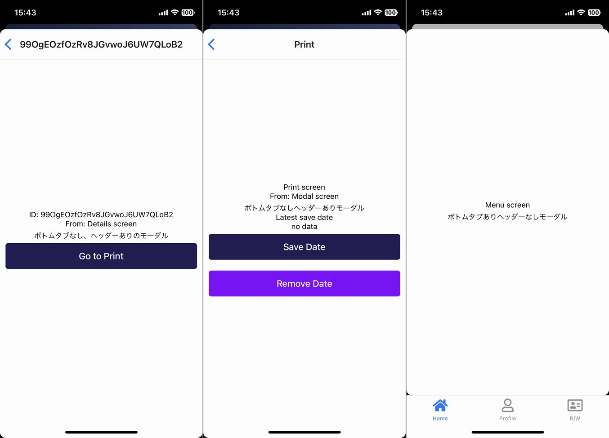

# React Native Expo with Firebase boiperplate

This is a React Native Expo project, with React Native Firebase setup. Not Firebase JS SDK.

## Screens

### Sign up and login on SMS authentication


### Edit profile and Upload images to cloud storage


### Stack, BottomTab, TopTab, Modal navigation




### Toast and Push Notification


## Features

- BottomTab, TopTab, Modal and Stack navigation
- Registration SMS
- Login with SMS
- Handling persisted login credentials
- Writing to Firestore Database
- Reading from Firestore Database
- Uploading images to Cloud Storage
- Update user profile
- Dynamic header title
- Retrieving Expo push tokens and saving them to Firestore

## Libraries

- expo
- react-native-firebase
- axios
- react-navigation
- expo-image-manipulator
- expo-image-picker
- expo-notifications
- react-native-elements
- react-native-svg
- react-native-vector-icons
- moment
- lottie-react-native

### Requirements

- expo account
- Node 16
- Yarn 1.22.x
- expo-cli
- eas-cli

## How to use

### 1. Install

Download zip or click "Use this template"

```
yarn install
```

### 2. Setting `app.json`

Write your app name and slug

```
"name": "expo-native-firebase-boilerplate",
"slug": "expo-native-firebase-boilerplate",
```

Write your `bundleIdentifier` and `package`

```
"bundleIdentifier": "expo.native.firebase.boilerplate",
```

```
"package": "expo.nativefirebase.boilerplate",
```

### 3. Setting up Firebase

**Step 1: Create a Google Firebase Account**

- Go to [https://console.firebase.google.com/](https://console.firebase.google.com/)
- Sign up an account and create a new project
- Put in your project name, click "Continue".
- Google Analytics can be enabled or disabled.
- Click "Create Project" it is going to take a while before it says "Your new project is ready", click "Continue."

**Step 2: Configure Firebase Console Sign-In Methods**

- On "Project Overview", click the "Authentication" on the left sidebar.
- Click on the second tab where it said "Sign-In method"
- Enable all the Sign-in method you would like to enable. For now, we will enable the "Phone" option.


**Step 3: Configure Firebase Console Firestore**

- We will then click the "Cloud Firestore" on the left to create a database.
- Select the "Start in test mode" option, click "next."
- Select the "Cloud Firestore location", click "Enable"
- Create the "users" and "tokens" collections. An empty document is fine.


***Security Rules***

```
rules_version = '2';
service cloud.firestore {
  match /databases/{database}/documents {
    match /{document=**} {
      allow read, write: if true;
    }
  }
}
```

**Step 4: Create a folder in Cloud Storage**

- Next. Click Storage on the left.
- Create an empty "avatar" folder.
- Upload the image file "icon.png" of your choice. This is the default icon for app users.


***Security Rules***

```
rules_version = '2';
service firebase.storage {
  match /b/{bucket}/o {
    match /{allPaths=**} {
      allow read, write: if request.auth != null;
    }
  }
}
```

**Step 5: Add iOS and Android apps to your Firebase project**

- Add iOS app
- Apple bundle ID is the `bundleIdentifier` in `app.json`.


- Add Android app
- Android package name is the `package` in `app.json`.


**Step 6: Download .json and .plist**

Download `google-services.json` and `GoogleService-Info.plist`


Put the 2 files in the root directory.


### 4. Setting up app configs

`username` is the Expo account that the project is associated with, and projectSlug is your `slug` from `app.json`

`src\config.js`

```
const defaultAvatar = 'your default icon url'
const experienceId = '@username/projectSlug'
```

### 5. Build the develop client

**Step 1: Register iPhone in Ad Hoc and install profile on iPhone**

```
eas device:create
```

**Step 2: Build your App and Install your App on your device**

```
eas build --profile development --platform ios
eas build --profile development --platform android
```

### 6. Uploading Server Credentials

**Using FCM for Push Notifications**

1. At the top of the sidebar, click the gear icon to the right of Project Overview to go to your project settings.
2. Click on the Cloud Messaging tab in the Settings pane.
3. Copy the token listed next to Server key.

```
expo push:android:upload --api-key <your-token-here>
```


**APNs authentication**

1. Download your APNs Push Key from expo's dashboard.
2. Upload your APNs Push Key to Firebase.


**Copy your Android app Credentials**

1. Copy your **SHA-1 Certificate Fingerprint** and **SHA-256 Certificate Fingerprint** from expo's dashboard.
2. Paste your credentials.


### 7. Run your app

```
yarn start
```

Scan the QR code above with Expo Go (Android) or the Camera app (iOS)

## NOTES

### EAS commands

```
// build: develop
eas build --profile development --platform ios
eas build --profile development --platform android

// build: internal
eas build --profile preview --platform ios
eas build --profile preview --platform android

// build: production
eas build --profile production --platform ios
eas build --profile production --platform android

// OTA update
expo publish --release-channel internal
expo publish --release-channel production

// iOS: Setting up ad hoc provisioning
eas device:create
// list all registered devices for your account
eas device:list
```

### .easignore

If you want to use environment variables in EAS build, create .easignore.

[How projects are uploaded to EAS Build](https://github.com/expo/fyi/blob/main/eas-build-archive.md)

## Licence

This project is available under the MIT license. See the [LICENSE](https://github.com/kiyohken2000/expo-native-firebase-boilerplate/blob/main/LICENSE) file for more info.